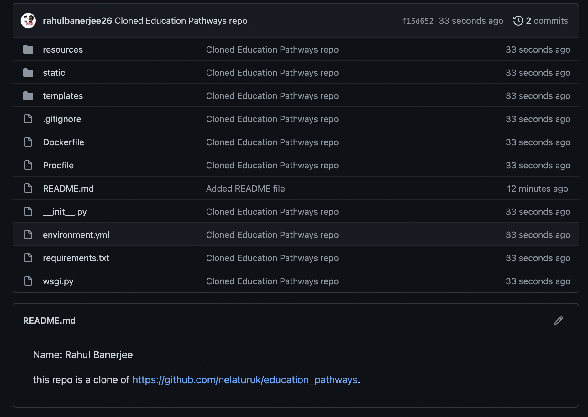
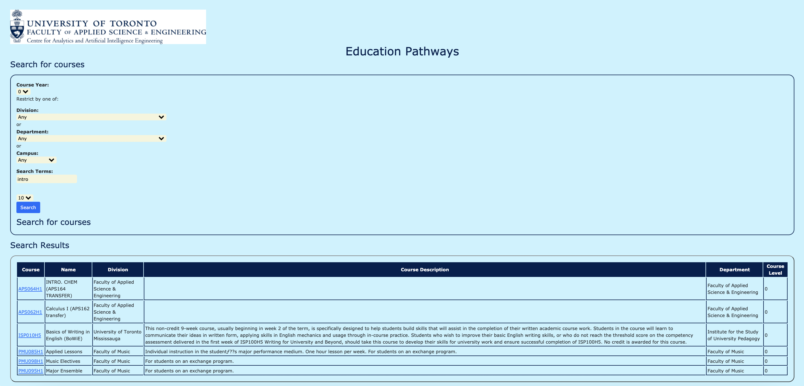
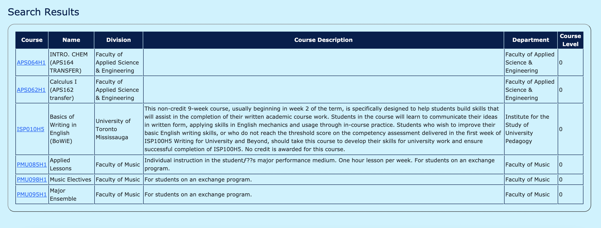

Name: Rahul Banerjee 

this repo is a clone of https://github.com/nelaturuk/education_pathways.

### Activity1 Screenshot of Repo

### Activity 4 Screenshots of App

#### Overview (Zoom was set at like 60% to get the entire picture)

#### Home Page

#### Results Table

### Activity 3
In the previous UI, positioning properties were not used much. All of the content was stuck to the left of the screen. The form fields didn't have any margin between them either. In the new UI, margins and padding having been added to various elements. This makes the content look more readable and there is enough space between different elements as well.
